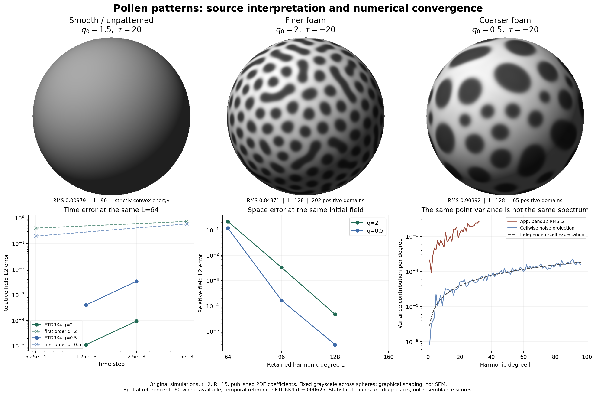

# 開発ガイド

[English](development.en.md) · [利用ガイド](user-guide.ja.md) · [リポジトリ](https://github.com/gyroid-eth/pollenarium)

Pollenariumは静的なブラウザアプリです。実行時にはネイティブES modules、module Web Worker、WebGL、IndexedDBを使います。npmのインストール、外部フォント、アプリ専用のサーバAPIは不要です。Python 3で配信・ビルドし、Node.jsで数値テストを実行します。これらのAPIと`<dialog>`に対応したブラウザを使ってください。高解像度メッシュの表示には`OES_element_index_uint`も必要です。

## 起動とビルド

リポジトリのルートで実行します。

```sh
python3 -m http.server 8916 --bind 127.0.0.1
```

[localhost:8916](http://localhost:8916/)を開きます。HTMLファイルを直接開く方法ではなくHTTPで配信してください。modules、データ取得、Workerは配信されたアプリの実行環境を必要とします。

画像を同梱しない静的版のビルド：

```sh
python3 scripts/build_static.py
```

出力先は`.site/`です。上記サーバを動かしたまま[サブパスのビルド](http://localhost:8916/.site/)を開くと、プロジェクト配下でのURL解決も確認できます。同じオリジンのルート版とサブパス版は標本データベースを共有し、独立したテスト用プロファイルにはなりません。

### 別条件の教育用画像パック

[公開教育デモ](https://gyroid-eth.github.io/pollenarium/)は、PalDatの画像を別条件のパックとして配信する構成です。デプロイ時にmanifestへ個別記録した52点だけを取得し、SHA-256を検証してビルドに含めます。

```sh
python3 scripts/fetch_reference_media.py
python3 scripts/build_static.py --educational-media
```

取得スクリプトはmanifestのSHA-256と照合し、元画像が変わっていたら確認を求めて止まります。追加画像の探索や一括収集はしません。写真をGit履歴に入れず、配信成果物へ含めることもMIT化を意味しません。後で通常の画像なしビルドを行うと、生成先に残った画像ディレクトリは除去されます。

撮影者名、出典リンク、元の画像全体、スケールバーを保持してください。教育・非商用の例外は、商用利用やあらゆる再配布を認める一般ライセンスではありません。配信方法を変更する前に[画像の権利](../references/PALDAT_RIGHTS.md)と[公開に関する説明](../PUBLICATION_NOTES.md)を確認してください。

## コードの構成

| パス | 役割 |
| --- | --- |
| `app/index.html`, `app/style.css` | 比較画面、操作部、アトラス、レスポンシブ表示 |
| `app/main.mjs` | UI状態、モデル操作、Workerのジョブ、参照標本と保存カード |
| `app/atlas.mjs` | 学名検索、見た目のフィルタ、標本選択、ダイアログのフォーカス |
| `app/worker.mjs` | Eq. 6/Eq. 7の振り分け、停止・復元、計算の実行管理 |
| `app/spectral.mjs` | 球面基底・変換、初期場、旧Eq. 7ソルバー |
| `app/etdrk4.mjs` | 現行Eq. 7の指数型RK4と、エネルギー判定による刻み縮小 |
| `app/equilibrium.mjs` | 制限部分空間でのEq. 6多始点探索 |
| `app/renderer.mjs` | スカラー場の図示と表示条件 |
| `app/storage.mjs` | 記録の検証、IndexedDB、JSON入出力 |
| `references/` | 論文の係数プリセットと画像ごとの出典・権利 |
| `assets/`, `diagnostics/` | 独自の候補計算と数値診断の結果 |
| `scripts/`, `tests/` | 静的ビルド、選定画像の取得、数値検証 |

参照画像の選択は、計算プリセットや数値場から独立させます。Table 1に同じ学名があるだけで、選択した写真にその係数が適合したとはいえません。アトラスの分類も、見える特徴から探すための索引です。生物学的な分類やモデルの一致判定ではありません。

## 数値テスト

Node.js標準のassertとES modulesで実行できます。

```sh
node tests/spectral.test.mjs
node tests/equilibrium.test.mjs
node tests/etdrk4.test.mjs
node tests/etdrk4-continuation.test.mjs
```

球面変換・積分、初期場の決定性、平均保存、エネルギーの挙動、線形成長と選択次数、勾配・対称性、精度改善、保存状態からの続行を確認します。通過しても、任意の条件での精度を保証するわけではありません。

数値実装を変える場合は、同じ初期係数・物理係数・観測時刻で比較します。場全体の誤差と、区画数などの形態統計を両方見てください。区画数が安定していても、欠陥位置は大きくずれることがあります。定数モードの保存、時間誤差と空間誤差の分離、モデル別の保存・続行も確認します。Eq. 6では複数の初期配置のエネルギーと制限部分空間の勾配を比較し、1回の探索の収束だけで大域最小と呼ばないでください。

[数値再現診断](../REPRODUCTION_DIAGNOSTICS.md)に、参照計算と再実行手順があります。`node scripts/prepare_numerical_audit.mjs`が固定初期ベクトルを準備します。その後の監査スクリプトは単体テストより長時間を要し、大きな出力を作る場合があります。作業先は既定で`.numerical-audit/`、環境変数`POLLEN_AUDIT_DIR`で変更できます。独立したPython比較計算にはNumPy、SciPy、Matplotlibを使い、診断メッシュの再構築にはFiPyとGmshも使いました。これらはアプリ実行時の依存関係ではありません。

監査スクリプトは管理対象の結果JSONを書き換える場合があるため、再生成後は差分を確認してください。旧1次時間積分の監査データは過去の証拠であり、現行ソルバーの結果ではありません。



独自計算による数値検証図。上段は3条件の場の図示、下段は時間刻み・空間解像度・初期スペクトルの比較です。SEM画像は含みません。

## 記録形式と互換性

記録形式は`pollen-specimen/2`です。`state`にはモデル識別子、全係数、パラメータ、時刻または探索情報が入り、記録には参照情報・表示条件・生成PNGも含まれます。検証処理の正本は`app/storage.mjs`です。

| モデル識別子 | 復元・続行 |
| --- | --- |
| `radja-eq6-restricted-real-harmonics-v1` | 場と条件を復元し、再探索は新しい最適化として開始 |
| `radja-eq7-spherical-etdrk4-v2` | 保存係数と次の刻みから指数型RK4で続行 |
| `radja-eq7-spherical-spectral-v1` | 元の1次時間積分法で続行 |

保存状態を別の積分法として黙って解釈し直さないでください。数値更新で続行の意味が変わるなら、明示的なバージョンと互換性方針が必要です。製品名の変更だけを理由にデータベース名を変える必要はありません。現在はIndexedDBの`pollen-specimen-cabinet`内の`specimens`を使います。

JSON読み込みは新しいIDを追加し、元のIDを`importedFrom`として保持します。書き出しにはSEMのバイト列は入りませんが、ユーザーの観察メモと参照URLは含まれます。これらはユーザーの内容として扱います。描画は場の有界な図示であり、凹凸の表示変更でソルバーの係数を変えてはいけません。

## UIと公開前の確認

UI変更後は、実際のデスクトップ・モバイル画面、両モデル、詳細設定を開いた状態を確認します。検索・フィルタ・該当なし表示、参照先と撮影者の切替、Escape・Enter・フォーカス復帰、保存復元とJSON、画像なしのサブパス版も確認します。計算を停止した状態で、観察標本を切り替える前後の全保存stateを比較すると、意図しない計算のリセットを検出できます。保存領域を消すテストには独立したブラウザプロファイルを使ってください。

独自コードと独自のプロジェクト成果物は[MIT](../LICENSE)です。著者実装・論文・PalDat写真はそのライセンスに含まれません。研究の引用を保持し、近似と未検証事項を明記します。第三者の科学計算コードや画像を追加する前には、ライセンスと出典を確認してください。
